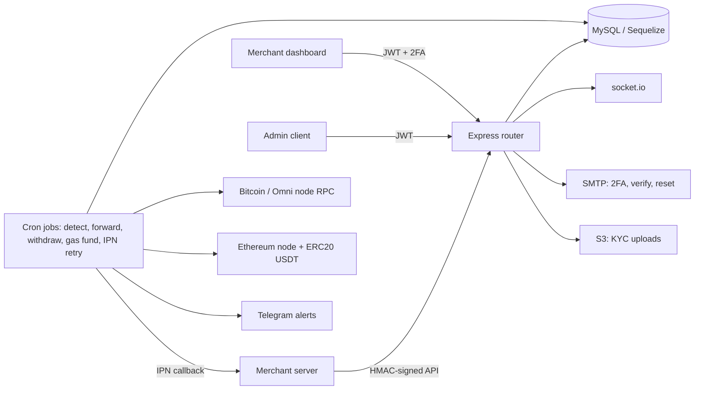

# wallet-service-mono

A single-process Node.js/Express backend for a merchant crypto payment gateway: merchants register, get API keys, create payment requests, receive deposits on generated addresses, and withdraw balances. Deposits are detected and forwarded by cron jobs; merchants are notified by signed IPN callbacks.

> Reference code, not audited. Do not use it to hold real funds without your own review.

## Architecture

## Services and stack

- Entry: `usdt-wallet-server.js` (Express, socket.io); routes in `router.js`.
- `lib/dashboard.js` merchant dashboard logic, `lib/admin.js` admin logic, `lib/usdt_pg-local.js` merchant API.
- `lib/cron_job.js` deposit detection, forwarding/clearing, withdrawals, gas funding, IPN retry.
- `lib/classes/*` chain adapters (Bitcoin/Omni, Ethereum, ERC20 USDT); `lib/bot.js` Telegram alerts; `lib/aws.js` S3.
- Stack: Node.js, Express, Sequelize (MySQL), web3, bitcoinjs-lib, bitcoin-core RPC, nodemailer, otplib (TOTP), socket.io.
- Reseller fee model: `reseller_fee` is an optional per-merchant commission applied to fees (see `lib/admin.js`, `lib/dashboard.js`).

## Supported chains

Bitcoin, USDT on Omni (via a Bitcoin/Omni Core node), Ethereum and ERC20 USDT.

## API surface

All paths are under the `PREFIX` (default `/v1`).

- Merchant API (HMAC-signed, `apikey` header): `POST /transaction/create`, `/transaction/info`, `/transaction/pending`, `/transaction/bulkWithdraw`, `/ipn/validate`; `GET|POST /networkfee`; `GET /info`.
- Dashboard (JWT): `/merchant/register|login|login/forgot|reset/*|verify|password|info|orders|withdraw[/check|/bulk[/check]]|verification|api[/status]|ipn[/handle|/history|/resend|/sample]|deposits[/gen|/address]|2fa/*|chart/orders|tokens|kyc|whitelistips|transaction/toggle`.
- Admin (JWT): `/admin/user`, `/admin/user/register`, `/admin/ipn/resend`, `/admin/withdraw/verify|total`, `/admin/kyc`.
- Test: `POST /test/ipn_listener`.

**Security note:** `/test/ipn_listener` and the public registration/login/reset routes are unauthenticated by design, and no network-level controls are included. Run this service behind network-level protection (firewall, VPN, reverse proxy allowlist) and do not expose the admin or test routes publicly.

## Setup

1. `npm install`
2. Create a MySQL database (`sql_schema/schema.sql` holds a legacy subset; Sequelize models in `db/sql.js` auto-sync).
3. Run a Bitcoin/Omni node with RPC and an Ethereum node, then `cp .env.example config/.env` and fill in values.
4. `node usdt-wallet-server.js dev` (or `prod`). `npm run check` does a syntax check of the entry files.

## Environment variables

Every `DEV_*` variable has a `PROD_*` twin; the run argument selects the set. See `.env.example`.

| Variable | Purpose |
|---|---|
| `MAIN_URL`, `MAIN_DOMAIN`, `MAIN_PORT`, `PREFIX` | Public URL, port and API path prefix |
| `DB_SCHEMA`, `DB_HOST`, `DB_USER`, `DB_PASSWORD`, `DB_SSL_CA_PATH` | MySQL; CA path optional (enables TLS verification) |
| `USDT_NODE_{NETWORK,HOST,PORT,USER,PASSWORD}` | Bitcoin/Omni node RPC |
| `ETH_NODE_NETWORK` | Ethereum network |
| `WALLET_ADDR_{FUNDER,WITHDRAW,DESTADDR}`, `ETH_WALLET_ADDR_{WITHDRAW,COLD}`, `ETH_WALLET_PASSWORD` | Hot/cold wallet addresses and keystore password |
| `CMC_CRED`, `ETHERSCAN_APIKEY`, `IPDATA_APIKEY` | Third-party API keys |
| `EMAIL_{2FA,VERILINK,PASSRESET}_{HOST,PORT,PASSWORD}` | SMTP settings |
| `ENDPOINTS_SECRET` | JWT signing secret |
| `TELEGRAM_KEY`, `TELEGRAM_GROUP_{SYSTEM,MONITOR,ADMIN}` | Telegram alerts |
| `AWS_APIKEY`, `AWS_SECRETKEY`, `AWS_BUCKET_NAME` | S3 for KYC uploads |
| `AES_KEY`, `AES_INITIAL_VECTOR` | AES encryption of stored secrets |
| `WITHDRAWAL_VERIFY_AMT` | Withdrawal amount requiring extra verification |
| `BRAND_NAME`, `EMAIL_FROM_ADDRESS` (unprefixed) | Display name and sender address |
| `IPN_TEST_*` (unprefixed) | Only for `lib/tests/ipn_listener.js` |

## Context

Built between 2019 and 2020 as an in-house payment gateway backend. This repository is a squashed snapshot; the original history is not published. Credentials, data dumps, brand assets and the third-party UI theme were removed and the email templates replaced with minimal neutral ones.

## Notice

Dependencies keep their own licenses. The MIT license covers the code in this repository.
